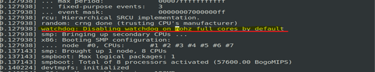
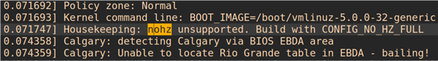
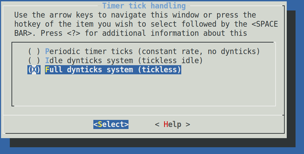
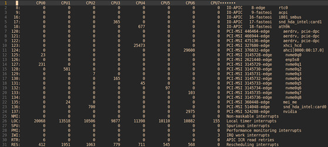
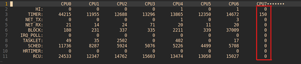
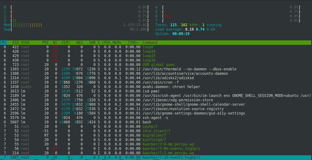

# Linux系统性能评测基准系统配置及其原理

全文转载，文章来源：[https://mp.weixin.qq.com/s/nkiE4CEo_zSN35I_qITAvQ](https://mp.weixin.qq.com/s/nkiE4CEo_zSN35I_qITAvQ)


## 概要

开发人员在高性能系统的性能调优过程中，经常会碰到各种背景的噪声干扰，从而使得收集的数据不够精确。本文主要从CPU以及Linux操作系统的角度来分析各种噪声的来源以及消除方法。最终的目标是搭建基准平台，在特定的cpu上实现”0”干扰。

## Cpu 运行中存在的几种背景噪声干扰来源

### 1. 调度器：

进程调度器对于系统的影响几乎无处不在，Linux内核一般来说是使用公平的分时调度策略（CFS）。需要特定的参数来调整调度器的行为，从而尽量减少对于测量进程的干扰。

### 2. 中断：

中断是系统必须要响应的事件，具有较高优先级，可以抢占普通的用户进程。

* a. 硬件中断

    主要来自外部事件，CPU需要非常及时的响应。比如最常见的IO，时钟，Linux内核支持的硬件中断数量众多，需要注意亲和性配置。可以取消响应一些比较特殊的中断。

* b. 软中断Softirq

    软中断是硬件中断处理的衍生子系统。Linux硬件中断响应只需要处理一些必须立即响应的操作，而将一些可以延后处理的操作移交给软中断。Linux中的有10类软中断，后续我们将会分析。

* c. Workqueue

    Workqueue也是Linux中常见的一类延迟操作的任务类型

### 3. 电源管理：

现代处理器通常为了更高效的利用能源，都会支持一些高级电源管理的功能。这些电源管理的功能如果使用不当也会对于性能评测造成影响。

### 4. 时间源：

如果要进行性能评测，就离不开时间戳。所以时间戳的正确采集方法也是至关重要的。

以上这几种因素往往是互相交织的，比如进程调度器需要时钟中断来驱动，电源管理子系统需要调度器来驱动。时间戳的采集和微架构也是息息相关的。下面我们将通过案例逐一分析。

## 系统配置案例

* 系统配置信息：

    ```
    CPU: Intel 9900KF   P1 Frequency 3.6Ghz   1-core Turbo  5.0Ghz   HT-disabled
    RAM: 16GB DDR4-3200
    Ubuntu 19.04:  Kernel  5.0.0-38-generic  X86_64
    Boot Parameter:
    BOOT_IMAGE=/boot/vmlinuz-5.0.0-38-generic
    root=UUID=697aea9f-2de2-4b9c-921d-5bd5f963c91f ro ipv6.disable=1
    isolcpus=7 nohz_full=7 mce=off tsc=reliable no_watchdog  irqaffinity=0 hpet=disable
    quiet splash vt.handoff=1
    ```

* 基准系统配置目标：

    在baremetal机器上(vt-x环境下配置会更加复杂难以精确控制）， 将Core 7隔离在调度器之外， 最大程度的减少各种因素对于Core 7的干扰。

* 启动参数详解：

    * isolcpus = managed_irq cpuslist

        Isolcpus 主要是将目标cpu从调度器的调度算法中隔离出来。也就是说从用户进程的角度来说，调度器不会主动调度任何进程到目标cpu上来。但是仅仅靠这个参数仍然不能保证所有软/硬中断和一些其他的内核组件不会运行在目标的cpu上。

    * nohzfull = cpulist

        这个参数还有一个相对弱化的版本nohz。nohz的含义是在目标cpu的runqueue上没有任何可调度实体时，cpu进入idle状态，在此情况下该cpu停止时钟tick（缺省是10ms一次）。那么nohzfull就更进一步，在runqueue上只有一个活动的实体的时候也会停止时钟tick。这样就会大大减少对正在运行的唯一的进程的干扰（不是100%消除）。值得注意的是在非服务器版本的内核中nohzfull一般是没有打开的，需要重新编译内核。大家可以检查对应的内核编译选项CONFIGNOHZFULL=y。如果没有打开则会在启动日志中显示警告。同时nohzfull也就隐含了rcunocbs=cpulist。

        下图是成功打开选项的日志。

        

        下图是没有打开编译选项的报错信息。

        

        在内核的Timer System 中修改选项。

        

    * nowatchdog

        关闭所有的软/硬件死锁监测。

    * hpet=disable, tsc=reliable

        这部分主要是针对时间子系统。hpet=disable 主要是避免hpet产生过多的中断干扰系统。tsc=reliable 标记tsc为可靠的，减少运行时，时间源校验。在我们的验证过程中，这个参数对于减少jitter有较大帮助。

## 软硬中断的隔离

* Disable irqblance service

    我们并不希望任何硬件中断被发送到Core 7上

    所以我们需要disable  irqblance service

* Take care irq affinity

    硬件中断的亲和性也需要注意。

    同样是避免任何硬件中断被发送到Core 7
     
* 修改

    /sys/devices/virtual/workqueue/cpumask to 1

    效果对比截图

    下图是/proc/interrupts

    

    下图是 /proc/softirqs

    

    下图是htop显示的信息， 可以观察到core 7上的可调度实体已经压缩到了最少

    

## MSR

MSR(ModelSpecific Register) 是配置处理器和获取处理器状态信息的关键接口。 MSR主要分为两类。 

* Per-Core MSR
  
    这类的MSR 的读写指令都必须本地的Core执行，所以要尽量避免从其它的Core上来读写。例如 从Core 7上读写Core 3。

    这样Linux kernel还需要调度这个读写操作到目标Core 3上来 会带来不必要的延迟。

    同时 如果在用户层（ring3）中试图读写msr也需要切换到kernel来完成这个操作(通过IPI，CAL 中断）。也会对应用有干扰。

    对于性能评测来说最典型的就是APERF/MPERF，以及HWP对应的MSR，以及PMU的配置接口MSR都是Per-Core。访问Per-MSR的延迟无法完全避免，所以要注意采样的频率，防止过度采样。

* Un-Core MSR
  
    这类MSR并不属于任何具体的Core，是公共资源。最典型的就是UNCORE_RATIO_LIMIT MSR。Un-Core MSR可以从任一Core发起读写。只要避免从正在评测的Core发起读写即可.

    通常来讲，MSR需要通过 加载内核模块msr（/dev/msr), 之后通过rdmsr/wrmsr工具来操作。

## 电源管理

Linux kernel中的电源管理主要由以下的两个子系统来完成。在kernel 4.10以后，电源管理系统是由调度器来触发。

* CPU freq

    CPU freq 子系统主要管理在C0状态下 处理器频率的调整，主要由两部分组成：

    1. CPU freq driver

        主要是针对各种不同硬件适配的对应的调频驱动程序。

    2. CPU freq governor

        主要是各种不同的调频策略。

    X86环境下主要有两种选择

    1. acpi_cpufreq driver以及其对应的7种governor

        见参考链接：
        [https://www.kernel.org/doc/html/v4.14/admin-guide/pm/cpufreq.html](https://www.kernel.org/doc/html/v4.14/admin-guide/pm/cpufreq.html)

    2. intel_pstate driver及其对应的2种governor（这是系统缺省的配置）

        intel_pstate driver是比较特别的驱动，相比于其它平台。intel_pstate driver主要是利用x86的HWP硬件特性来调整频率。提供了有限的可定制策略。自动化程度更好，overhead更少。

    
    sysfs entries

    * 见参考链接：
        [https://www.kernel.org/doc/html/v4.14/admin-guide/pm/cpufreq.html](https://www.kernel.org/doc/html/v4.14/admin-guide/pm/cpufreq.html)

* CPU idle
  
    CPU idle子系统主要管理在C1-C7状态下处理器idle状态调整，主要由两部分组成：

    1. CPU idle driver

        主要是针对各种不同硬件适配的对应的idle驱动程序

    2. CPU idle governor

        主要是各种不同的idle时长策略

    X86环境下主要有两种选择

    1. acpi_idle driver

        缺省是menu governor

    2. intel_idle driver

        缺省是menu governor（这是系统缺省的配置, ladder需要重新编译内核）

    sysfs entries

    * 见参考链接：

        [https://www.kernel.org/doc/html/latest/admin-guide/pm/cpuidle.html](https://www.kernel.org/doc/html/latest/admin-guide/pm/cpuidle.html)

推荐的配置方法：

1. 在BIOS中，Disable Turbo

2. 应用power.py[2]脚本锁定目标Core的频率（或者在BIOS 中disable Pstate）

3. 设定内核参数intel_idle.max_cstate=1. 

    如果需要彻底禁止idle 推荐 processor.max_cstate=0，idle=poll  
    这里需要注意 intel_idle.max_cstate=0只是disable intel_idle driver转而使用acpi_idle driver
    根据workload特点调整UNCORE_RATIO_LIMIT的min/max ratio 

## IPI，TLB Shootdown优化

进程隔离会减少shootdown，但是内核部分做不到隔离地址空间。仍然会导致一定数量的tlb shootdown。禁用 VT-X 减少 IPI。
MSR不要过采样！因为per core的MSR读写操作从非本地core调用，Linux是通过IPI调度到目标core上执行。

除此之外, 调度算法/NUMA Aware/L3Cache QoS(RDT)/SMM-BMC/SmartEngine等模块都会对系统性能测试有着噪音干扰，敬请期待后续内容~

## Reference

1. Intel SDM
2. Power.py

    [https://github.com/intel/CommsPowerManagement](https://github.com/intel/CommsPowerManagement)

3. [https://www.kernel.org/doc/Documentation/kernel-per-CPU-kthreads.txt](https://www.kernel.org/doc/Documentation/kernel-per-CPU-kthreads.txt)